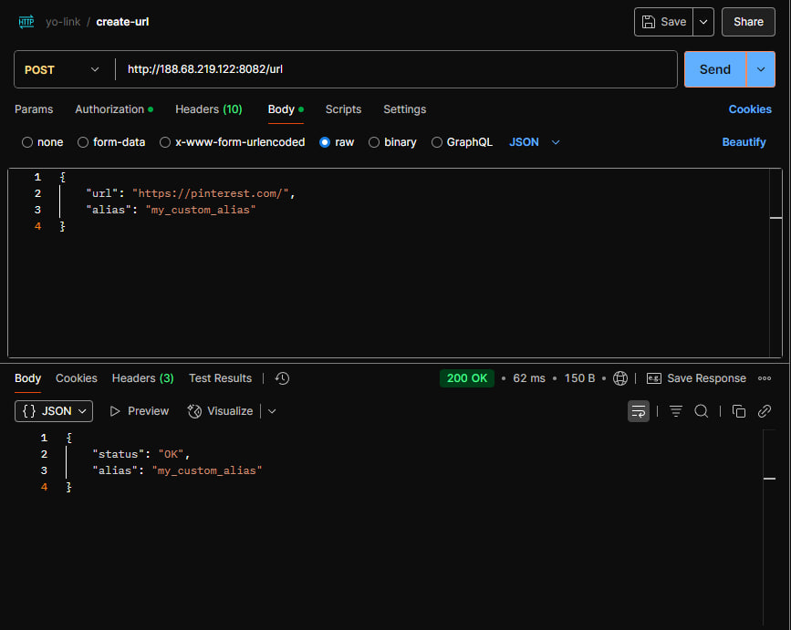
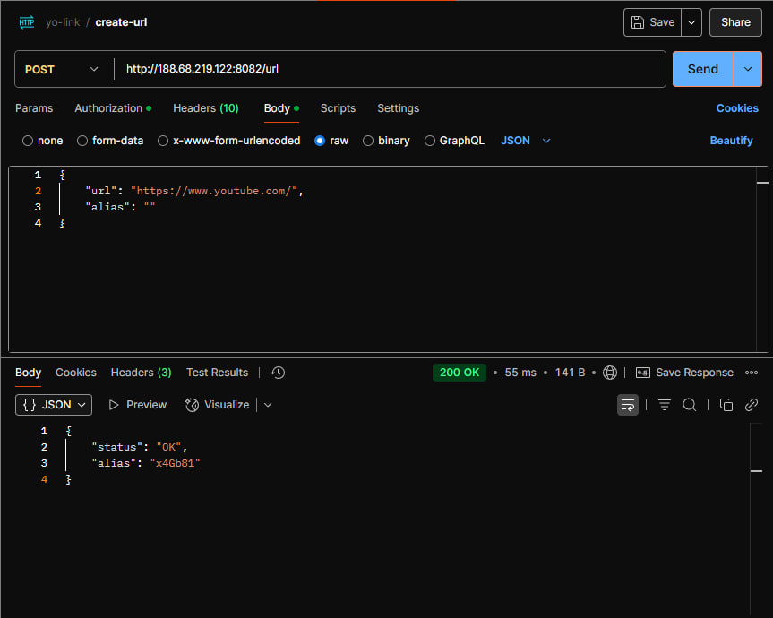
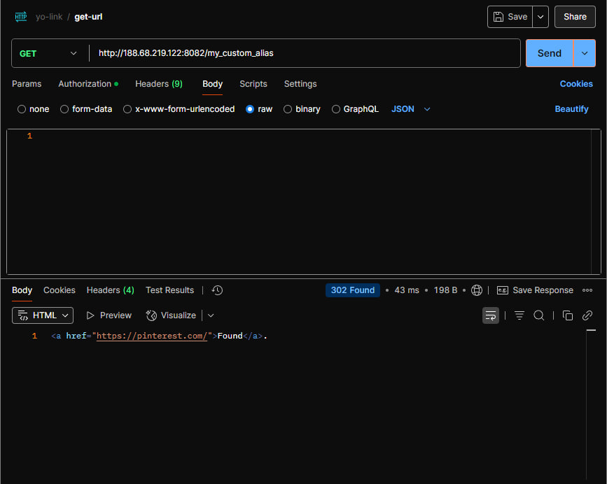

<h1 align="center">💫 About Project:</h1>

## 🧸 Yo-Link — Link shortening service with API and web interface

Yo-Link is a simple and fast URL shortening service written in Go. It supports REST API, authorization, and link customization

## 💻 Tech Stack:

 

### ✨ Key Features

- **URL Shortening Engine:** Shortening long URLs into short ones (for example,https://example.com/very-long-path → http://localhost:8082/yourAlias or http://yourdomain:8082/yourAlias)
- **Smart Storage:** All your links are stored securely in a local **SQLite** database, ensuring quick and reliable access without any third-party dependencies.
- **Link Protection:** HTTP Basic Auth for access protection.
- **Flexible setup:** Configuration via a YAML file.
- **Auto-start:** Deployment via systemd (included in the repository).
- **Integration with services:** REST API for integration with other services.

### 📄 API Documentation

| Заголовок 1 | Заголовок 2     | Заголовок 3                           | Requires Auth |
| ----------- | --------------- | ------------------------------------- | ------------- |
| `POST`      | `/url`          | _Create short URL from original link_ | ✅ **Yes**    |
| `GET`       | `/{your_alias}` | _Redirect to original UR_             | ❌ **No**     |

#### Request Body Format (JSON)

- When making a request to `/url`, you must send JSON in the format

`{
  "url": "https://example.com/very-long-url",
  "alias": "custom-name"
}`

##### Where:

- `/url` (required) - the original long link
- **`alias`** (optional) - the desired short name for the link (if not specified, it will be generated automatically)

### 📦 Deployment

- Automatic deployment via GitHub Actions:

  🪐 Specify the secrets (`DEPLOY_SSH_KEY`, `AUTH_PASS`) in the repository settings.

  🪐 Manually launch the workflow **Deploy App** by specifying the version (tag).

- Configuration for systemd: deployment/yo-link.service.

## 📸 Screenshots

- **Request** `/POST` **with alias**

  

- **Request** `/POST` **without alias**

  

- **Request** `/GET`

  

## 🛠️ Installation

### Prerequisites

- [Go 1.22+](https://golang.org/dl/)

### 🪭 Quick Setup

#### Clone repository

- git clone https://github.com/yowie645/Yo-Link.git
- cd Yo-Link

#### Run

- go run \path\Yo-link\cmd\yo-link\main.go

